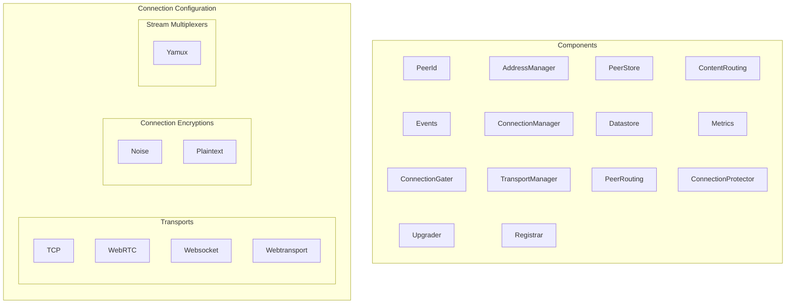
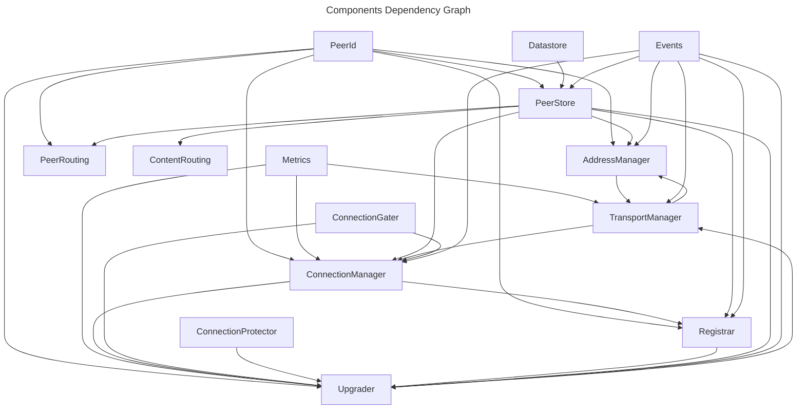
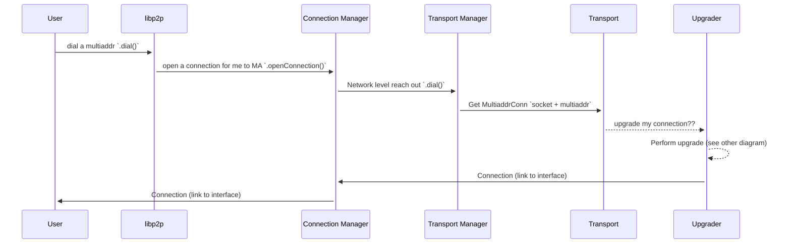
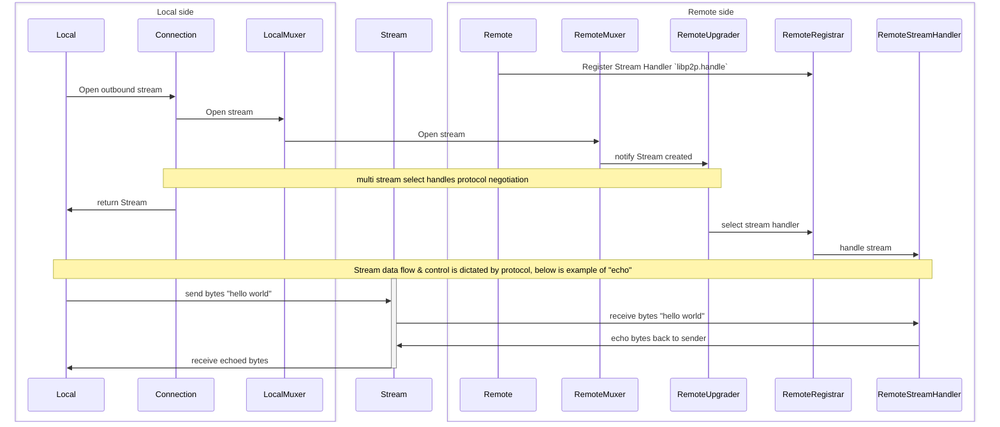

# Libp2p Architecture

js-libp2p is comprised of a number of components that work together to provide functionality such as dialing peers, managing connections, registering protocols, storing information about peers and much more. This document aims to provide a high level overview of the components and how they interact with each other.

- [Libp2p Architecture](#libp2p-architecture)
  - [Component Diagram](#component-diagram)
  - [Sequence Diagrams](#sequence-diagrams)
    - [Dialing a Peer](#dialing-a-peer)
    - [Opening a stream on a connection](#opening-a-stream-on-a-connection)

## Component Diagram

## Sequence Diagrams

These diagrams show the interactions between the components in common scenarios. They are not exhaustive and are intended to provide a high level overview of the interactions between the components.

### Dialing a Peer

This illustrates an outbound connection being established to a peer.

### Opening a stream on a connection

This illustrates a stream being opened on an existing connection that will echo a message back to the sender. This assumes that a stable connection has been established between the two peers.

